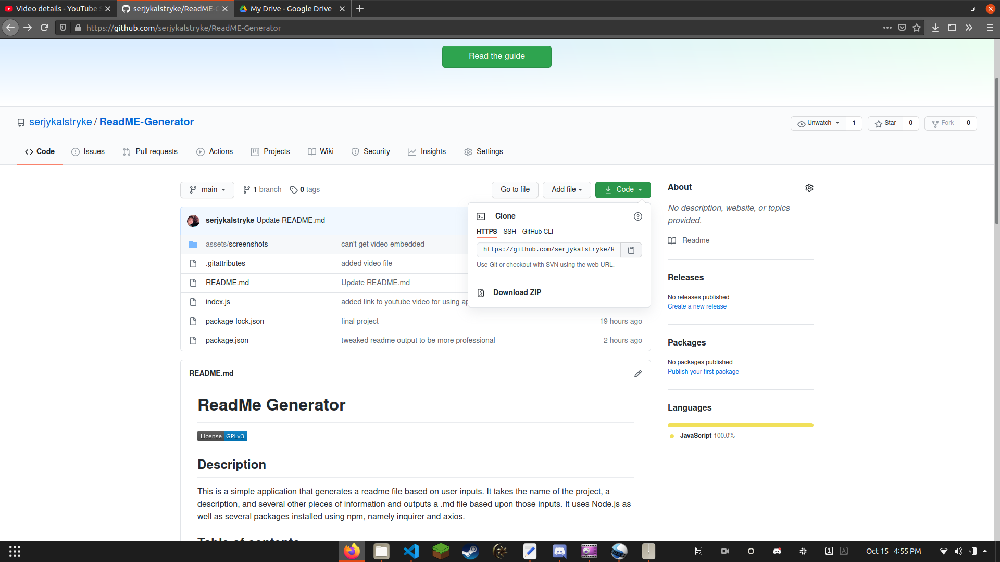
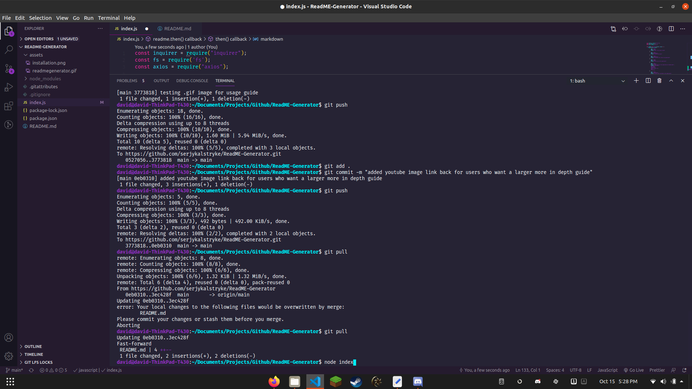

# **ReadMe Generator**

## Description 
This is a simple application that generates a readme file based on user inputs. It takes the name of the project, a description, and several other pieces of information and outputs a .md file based upon those inputs. It uses Node.js as well as several packages installed using npm, namely inquirer and axios. To generalize the use of this application, a user would need to add their own images to the assets folder and change the affiliated code and link to their own usage video. 
## Table of contents
- [**ReadMe Generator**](#readme-generator)
  - [Description](#description)
  - [Table of contents](#table-of-contents)
  - [Installation](#installation)
  - [Usage](#usage)
  - [Licence](#licence)
  - [Contributors](#contributors)
  - [Test](#test)
  - [Repository](#repository)
  - [Sample of application in action](#sample-of-application-in-action)
  - [Questions? Contact me here:](#questions-contact-me-here)
## Installation
By cloning the repository from Github

## Usage
Open a terminal window. cd into the folder where the application is installed and run using node index command. Once node index command is run, the application will ask for inputs via the terminal. Enter appropriate information and the application will output a file called README.md, which is a markdown file that any application capable of reading markdown will format properly. Click the below image for a video of the application in action, there is also a gif that conveys the general idea of using the application.

## Licence
GNU GPLv3
## Contributors
Myself, but if you want to contribute, feel free to fork this application and make any improvements you feel important.
## Test
Upon cloning/forking, run the application. If you hit any snags feel free to contact me via the contact information below
## Repository
- [Project Repo](https://github.com/serjykalstryke/ReadMe-Generator)

## Sample of application in action

## Questions? Contact me here:

- David Stinnett
- [GitHub Profile](https://github.com/serjykalstryke)
- <davidstinnett@icloud.com>
